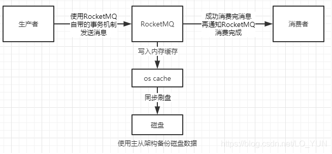

# RocketMQ 消息丢失场景分析及如何解决！


既然在项目中使用了MQ，那么就不可避免的需要考虑消息丢失问题。在一些涉及到了金钱交易的场景下，消息丢失还是很致命的。那么在RocketMQ中存在哪几种消息丢失的场景呢？

先来一张最简单的消费流程图：


上图中大致包含了这么几种场景：

- 生产者产生消息发送给RocketMQ
- RocketMQ接收到了消息之后，必然需要存到磁盘中，否则断电或宕机之后会造成数据的丢失
- 消费者从RocketMQ中获取消息消费，消费成功之后，整个流程结束

这三种场景都可能会产生消息的丢失，如下图所示：


1、场景1中生产者将消息发送给Rocket MQ的时候，如果出现了网络抖动或者通信异常等问题，消息就有可能会丢失

2、场景2中消息需要持久化到磁盘中，这时会有两种情况导致消息丢失

- RocketMQ为了减少磁盘的IO，会先将消息写入到os cache中，而不是直接写入到磁盘中，消费者从os cache中获取消息类似于直接从内存中获取消息，速度更快，过一段时间会由os线程异步的将消息刷入磁盘中，此时才算真正完成了消息的持久化。在这个过程中，如果消息还没有完成异步刷盘，RocketMQ中的Broker宕机的话，就会导致消息丢失
- 如果消息已经被刷入了磁盘中，但是数据没有做任何备份，一旦磁盘损坏，那么消息也会丢失

3、消费者成功从RocketMQ中获取到了消息，还没有将消息完全消费完的时候，就通知RocketMQ我已经将消息消费了，然后消费者宕机，但是RocketMQ认为消费者已经成功消费了数据，所以数据依旧丢失了。

那么如何保证消息的零丢失呢？




1、场景1中保证消息不丢失的方案是使用RocketMQ自带的事务机制来发送消息，大致流程为：

- 首先生产者发送half消息到RocketMQ中，此时消费者是无法消费half消息的，若half消息就发送失败了，则执行相应的回滚逻辑

- half消息发送成功之后，且RocketMQ返回成功响应，则执行生产者的核心链路

- 如果生产者自己的核心链路执行失败，则回滚，并通知RocketMQ删除half消息

- 如果生产者的核心链路执行成功，则通知RocketMQ commit half消息，让消费者可以消费这条数据

其中还有一些RocketMQ长时间没有收到生产者是要commit/rollback操作的响应，回调生产者接口的细节，感兴趣的可以参考：

`https://blog.csdn.net/LO_YUN/article/details/101673893`

在使用了RocketMQ事务将生产者的消息成功发送给RocketMQ，就可以保证在这个阶段消息不会丢失

2、在场景2中要保证消息不丢失，首先需要将os cache的异步刷盘策略改为同步刷盘，这一步需要修改Broker的配置文件，将flushDiskType改为SYNC_FLUSH同步刷盘策略，默认的是ASYNC_FLUSH异步刷盘。

一旦同步刷盘返回成功，那么就一定保证消息已经持久化到磁盘中了；为了保证磁盘损坏不会丢失数据，我们需要对RocketMQ采用主从机构，集群部署，Leader中的数据在多个Follower中都存有备份，防止单点故障。

3、在场景3中，消息到达了消费者，RocketMQ在代码中就能保证消息不会丢失

```
//注册消息监听器处理消息
consumer.registerMessageListener(new MessageListenerConcurrently() {
   @Override
    public ConsumeConcurrentlyStatus consumeMessage(List<MessageExt> msgs, ConsumeConcurrentlyContext context){                                  
        //对消息进行处理
        return ConsumeConcurrentlyStatus.CONSUME_SUCCESS;
    }
});
```

上面这段代码中，RocketMQ在消费者中注册了一个监听器，当消费者获取到了消息，就会去回调这个监听器函数，去处理里面的消息

当你的消息处理完毕之后，才会返回ConsumeConcurrentlyStatus.CONSUME_SUCCESS 只有返回了CONSUME_SUCCESS，消费者才会告诉RocketMQ我已经消费完了，此时如果消费者宕机，消息已经处理完了，也就不会丢失消息了

如果消费者还没有返回CONSUME_SUCCESS时就宕机了，那么RocketMQ就会认为你这个消费者节点挂掉了，会自动故障转移，将消息交给消费者组的其他消费者去消费这个消息，保证消息不会丢失

为了保证消息不会丢失，在consumeMessage方法中就直接写消息消费的业务逻辑就可以了，如果非要搞一些骚操作，比如下面的代码
```
//注册消息监听器处理消息
consumer.registerMessageListener(new MessageListenerConcurrently() {
   @Override
    public ConsumeConcurrentlyStatus consumeMessage(List<MessageExt> msgs, ConsumeConcurrentlyContext context){ 
     //开启子线程异步处理消息
     new Thread() {
   public void run() {
    //对消息进行处理
   }
  }.start();                                 
        return ConsumeConcurrentlyStatus.CONSUME_SUCCESS;
    }
});
```
如果新开子线程异步处理消息的话，就有可能出现消息还没有被消费完，消费者告诉RocketMQ消息已经被消费了，结果宕机丢失消息的情况。

使用上面一整套的方案就可以在使用RocketMQ时保证消息零丢失，但是性能和吞吐量也将大幅下降

- 使用事务机制传输消息，会比普通的消息传输多出很多步骤，耗费性能
- 同步刷盘相比异步刷盘，一个是存储在磁盘中，一个存储在内存中，速度完全不是一个数量级
- 主从机构的话，需要Leader将数据同步给Follower
- 消费时无法异步消费，只能等待消费完成再通知RocketMQ消费完成

消息零丢失是一把双刃剑，要想用好，还是要视具体的业务场景而定，选择合适的方案才是最好的。

